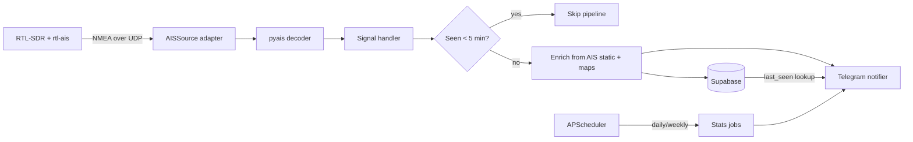

## AIS Vessel Notifications

### Stack
- Python 3.11+, `asyncio` end-to-end for low-latency notifications.
- `pyais` (NMEA/AIVDM decoding incl. multi-part assembly), `python-telegram-bot` (async), `supabase` (supabase-py), `APScheduler` (AsyncIOScheduler) for daily/weekly jobs, `python-dotenv` for config.

### Architecture

The `AISSource` is an abstract interface so the RTL-SDR can be swapped for serial, TCP, or a file replay without touching the rest of the system. Same pluggable pattern for enrichment providers and notifiers.

### Project layout (new files)
- `requirements.txt`, `.env.example`, `README.md`, `pyproject.toml`
- `src/ais_notify/config.py` - env-based settings (Supabase URL/key, Telegram token/chat id, UDP host/port, dedup window, timezone).
- `src/ais_notify/models.py` - dataclasses: `VesselSignal`, `Vessel`, `Sighting`.
- Sources (swappable input):
  - `src/ais_notify/sources/base.py` - `AISSource` ABC with `async iter_sentences()`.
  - `src/ais_notify/sources/udp_source.py` - reads NMEA from rtl-ais UDP (default, matches `rtl_ais -n -h 127.0.0.1 -P 10110`).
  - `src/ais_notify/sources/tcp_source.py`, `serial_source.py` - alternative inputs (serial for a future dAISy HAT).
  - `src/ais_notify/sources/file_source.py` - replay a captured NMEA file for testing without hardware.
- `src/ais_notify/decode.py` - wraps `pyais.stream`/`decode`, assembles multi-part messages, yields `VesselSignal` (position msgs 1/2/3/18 + static msg 5).
- Storage:
  - `src/ais_notify/db/supabase_client.py`, `src/ais_notify/db/repository.py` - `upsert_vessel`, `insert_sighting`, `get_last_sighting(mmsi)`.
  - `supabase/schema.sql` - table DDL (below).
- `src/ais_notify/dedup.py` - in-memory TTL cache (fast path) + DB fallback; 5-minute window per MMSI.
- Enrichment (pluggable, free):
  - `src/ais_notify/enrich/base.py` - `EnrichmentProvider` protocol.
  - `src/ais_notify/enrich/ais_static.py` - builds profile from Type 5 static data.
  - `src/ais_notify/enrich/shiptype.py` - AIS ship-type code -> human label ("Cargo", "Tanker", "Passenger"...).
  - `src/ais_notify/enrich/mmsi.py` - MID (first 3 MMSI digits) -> flag/country.
  - `src/ais_notify/enrich/photo.py` - optional, disabled by default (stub for Wikidata/scraper/paid key later).
- Notifications:
  - `src/ais_notify/notify/base.py` - `Notifier` protocol.
  - `src/ais_notify/notify/telegram.py` - async send.
  - `src/ais_notify/notify/formatter.py` - builds message (vessel info + "last seen X ago" / "first time seen").
- Stats:
  - `src/ais_notify/stats/queries.py` - aggregate sightings by day/week.
  - `src/ais_notify/stats/scheduler.py` - APScheduler jobs (daily ~23:59 local, weekly Sun).
- `src/ais_notify/main.py` - wires source -> decoder -> handler + starts scheduler.
- `deploy/ais-notify.service`, `deploy/rtl-ais.service` - systemd units for Pi (auto-start, restart on failure).

### Database schema (Supabase / Postgres)
- `vessels`: `mmsi bigint PK`, `name`, `imo`, `callsign`, `ship_type int`, `ship_type_label`, `length_m`, `width_m`, `draught`, `destination`, `eta`, `flag_country`, `photo_url`, `info jsonb`, `first_seen timestamptz`, `last_enriched timestamptz`, `updated_at timestamptz`.
- `sightings`: `id bigserial PK`, `mmsi bigint FK`, `ts timestamptz`, `lat`, `lon`, `sog`, `cog`, `heading`, `nav_status`, `source text`, `raw text`. Index on `(mmsi, ts desc)` and `(ts)` for stats.

### Notification flow (fast path)
1. New position signal arrives, passes 5-min dedup check.
2. Look up `get_last_sighting(mmsi)` -> compute "last seen X ago" or "first time seen".
3. Merge any known/just-decoded static data, format message, **send Telegram immediately**.
4. Persist sighting + upsert vessel (after sending, so notification latency stays minimal).

### Dedup logic
- Per-MMSI TTL cache (default 300s) checked first for speed; on miss, confirm against `get_last_sighting`. If within window, skip enrichment/notification/insert entirely. Cache survives within the long-running process; DB is source of truth across restarts.

### Stats
- Daily: total signals, unique vessels, new (first-ever) vessels, ship-type breakdown, top vessels by sightings, busiest hour.
- Weekly: same rolled up over 7 days + day-by-day trend. Both sent to Telegram.

### Suggested additional features (from your "what else" question)
- Local SQLite write-ahead buffer so sightings/notifications survive Supabase/network outages and sync later (Pi-friendly resilience).
- Geofencing / watchlist: alert (or louder alert) only when specific MMSIs or a port/area polygon is entered.
- "New vessel ever seen" highlight in notifications.
- Dashboard: lightweight web view (or just Supabase/Grafana) of recent traffic and a live map.
- Health/heartbeat: periodic "still alive, N msgs/min" check so you know reception stopped.
- Photo enrichment via Wikidata (free) for notable ships; pluggable slot for a paid API later.
- Rate limiting / digest mode for busy areas to avoid Telegram spam.
- Anomaly flags: AIS gaps, identity spoofing (duplicate MMSI), speed anomalies.

### Validation
- Run with `file_source` replaying a sample NMEA capture to verify decode -> dedup -> store -> notify -> stats end-to-end without hardware, then deploy on the Pi with rtl-ais via the systemd units.